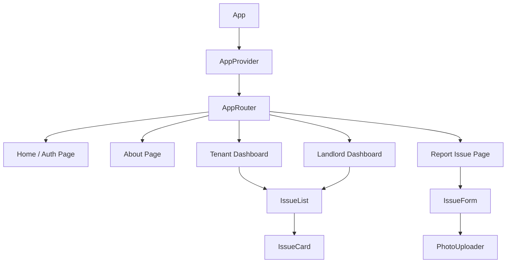

# Rentfix

React SPA connecting tenants and landlords for transparent maintenance tracking.

## Live Demo
[Vercel Deployment Link] (Coming soon)

## Problem Statement
Tenants struggle to report broken utilities clearly. Landlords can't track repair status efficiently. Communication is fragmented.

## Solution
Centralized platform where:
- Tenants submit issues with photos
- Landlords view and update repair status
- Both parties track progress transparently
- **Persistent Authentication:** Email-based login/signup with role persistence.

## Tech Stack
- **Frontend:** React 19 + Vite
- **Routing:** React Router v7 (SPA)
- **State Management:** Context API
- **Persistence:** Custom `useLocalStorage` hook
- **Styling:** Tailwind CSS

## Component Hierarchy


## Custom Hooks Breakdown
### `useMaintenanceReports`
Abstracts the complex business logic for filtering, creating, and updating maintenance reports. It ensures that a tenant only sees their own data while a landlord sees the entire property portfolio.

### `useLocalStorage`
A reusable utility hook that syncs React state with the browser's `localStorage`. It handles `JSON.stringify` and `JSON.parse` automatically, enabling persistent authentication and data across page refreshes.

## Team Structure & Roles
- **Kimberly Ayiaki:** Project Lead & Layout Design
- **Ronny Nyabuto:** Data Architecture & State Logic (Person 3)
- **Tamara Chebet:** UI Components & Styling
- **Maingi Mugambi:** Routing & Navigation

## Getting Started
```bash
npm install
npm run dev
```

## Branch Strategy
- `main`: Production-ready code
- `develop`: Integration branch
- `feature/*`: Individual feature branches

